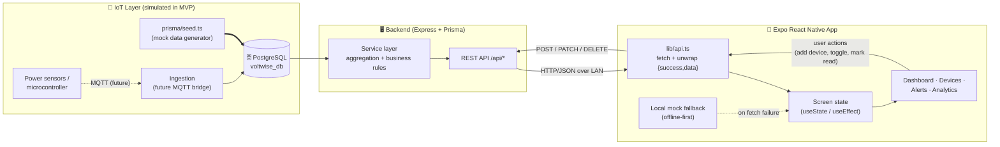
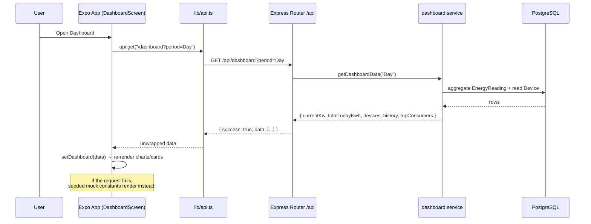
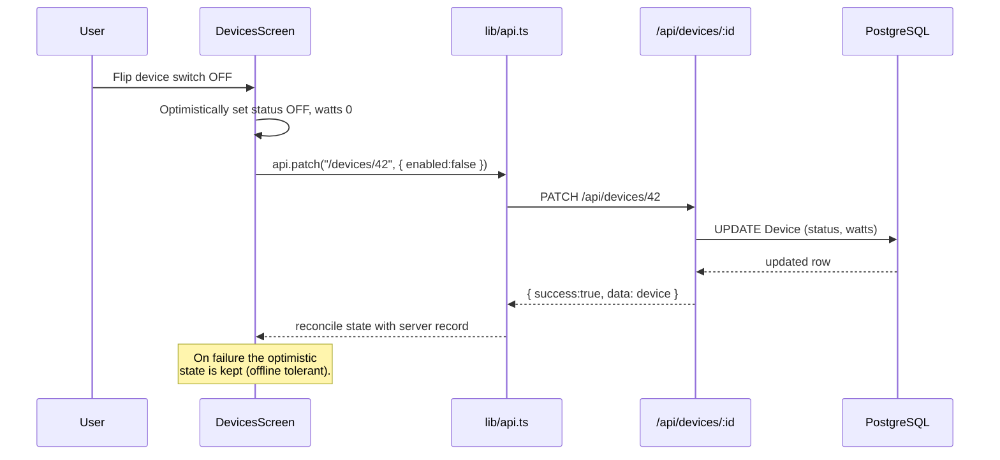
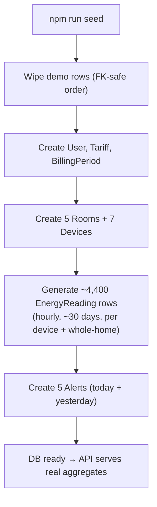

# VoltWise — Data Flow

How energy data travels from its source, through the backend, into the database,
and out to the mobile app for rendering. For the MVP the physical IoT layer is
**simulated by a seed script** (the dashed path); the rest of the pipeline is
production-shaped and unchanged for when real sensors come online.

## End-to-end data flow

## Read path — loading the dashboard

## Write path — toggling a device (optimistic UI)

## Mock data lifecycle (MVP)

## Key data contracts (backend → app)

All responses are wrapped as `{ "success": true, "data": <payload> }`; the app's
`lib/api.ts` transparently unwraps `data`.

| Endpoint | Payload shape (the `data`) |
|---|---|
| `GET /api/dashboard?period=` | `{ currentKw, totalTodayKwh, devices[], history{labels,data}, topConsumers[] }` |
| `GET /api/devices` | `[{ id, icon, name, room, status, watts, enabled }]` |
| `POST/PATCH/DELETE /api/devices/:id` | created/updated device or `{ success }` |
| `GET /api/alerts` | `[{ id, type, title, description, time, section, read, recommendation? }]` |
| `PATCH /api/alerts/:id/read`, `POST /api/alerts/read-all` | updated alert / `{ success }` |
| `GET /api/analytics?period=` | `{ billPredictor{...}, totalKwh, breakdown[], topConsumers[] }` |
| `GET /api/health` | `{ status: "ok" }` |
