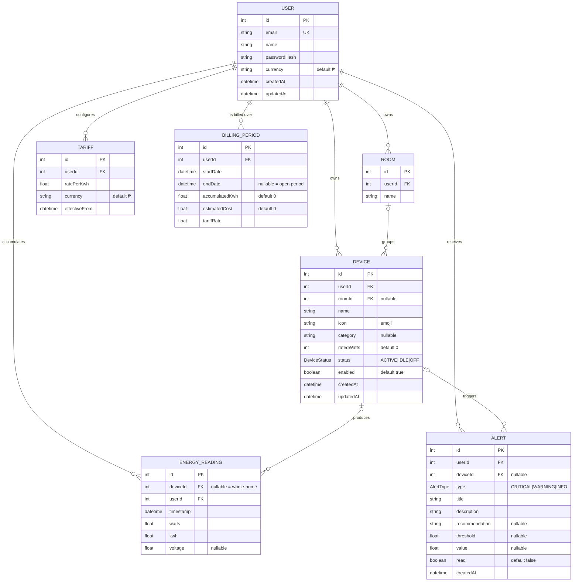

# VoltWise — Entity Relationship Diagram (ERD)

This ERD reflects the PostgreSQL database (`voltwise_db`) defined by the Prisma
schema at `backend/prisma/schema.prisma`. It is the **single source of truth**
for the relational model that powers the mobile MVP.

## Diagram



## Entities

| Entity | Purpose | Drives (app feature) |
|---|---|---|
| **User** | Account owner of the monitored premises. Holds display currency. | Profile, all scoping |
| **Room** | Logical grouping of devices (Bedroom, Kitchen…). | Device registry, breakdown labels |
| **Device** | Virtual appliance/circuit registry entry. Carries current `status` + `ratedWatts`. | Dashboard cards, Devices CRUD + toggles |
| **EnergyReading** | Time-series telemetry. `deviceId = null` ⇒ whole-home aggregate. | Live kW, usage history, breakdown, top consumers |
| **Alert** | Threshold/anomaly event log entry. | Alerts feed + notifications |
| **Tariff** | Utility rate (₱/kWh) with effective date (rate history). | Bill predictor |
| **BillingPeriod** | Current/closed billing cycle with accumulated kWh + estimate. | Bill predictor |

## Relationships & integrity rules

- **User 1—N everything.** Every domain row is scoped to a `userId`. Deleting a
  user **cascades** to all of their rows (`onDelete: Cascade`).
- **Room 0/1—N Device.** A device's `roomId` is **nullable**; deleting a room
  sets its devices' `roomId` to `NULL` (`onDelete: SetNull`) → shown as
  "Unassigned" in the app.
- **Device 0/1—N EnergyReading / Alert.** Both `deviceId` columns are
  **nullable** so the system can store whole-home readings and account-level
  alerts not tied to a specific device. Deleting a device **SetNull**s these
  rows (history/alerts survive the device's removal).
- **Indexes.** `EnergyReading` is indexed on `(deviceId, timestamp)` and
  `(userId, timestamp)` to keep the dashboard/analytics time-bucket aggregations
  fast.

## Enums

```
DeviceStatus = ACTIVE | IDLE | OFF
AlertType    = CRITICAL | WARNING | INFO
```

## Derived values (not stored — computed in the service layer)

- **Current kW** = Σ(watts of ACTIVE devices) ÷ 1000.
- **Usage history** = `kwh` summed into Day/Week/Month time buckets.
- **Top consumers / breakdown** = each device's share of total `kwh`, as integer %.
- **Estimated bill** = `Tariff.ratePerKwh × BillingPeriod.accumulatedKwh`.
