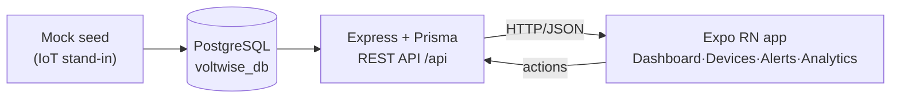

# VoltWise — Architecture & Design Docs

Comprehensive technical documentation for the VoltWise smart energy monitoring
MVP (Expo React Native app + Express/Prisma/PostgreSQL backend).

| Document | What it covers |
|---|---|
| [SYSTEM_ARCHITECTURE.md](./SYSTEM_ARCHITECTURE.md) | Overall system: tiers, tech stack, module→feature mapping, design principles, how to run it. |
| [ERD.md](./ERD.md) | Entity Relationship Diagram of `voltwise_db`: entities, attributes, relationships, integrity rules, enums. |
| [DATA_FLOW.md](./DATA_FLOW.md) | How data moves end-to-end: read/write paths, sequence diagrams, mock-data lifecycle, API contracts. |

All diagrams are written in [Mermaid](https://mermaid.js.org/) and render on
GitHub and in most Markdown previewers.

## System at a glance



## Repository layout

```
voltwise/
├── backend/        # Express 5 + Prisma 7 API (PostgreSQL)
│   ├── prisma/     # schema.prisma + seed.ts + migrations
│   └── src/        # index.ts, routes/, lib/, configs/, modules/<feature>/
├── voltwise/       # Expo React Native app (expo-router)
│   ├── app/(tabs)/ # dashboard · devices · alerts · analytics screens
│   └── lib/api.ts  # typed API client (unwraps {success,data})
└── docs/           # this folder
```
