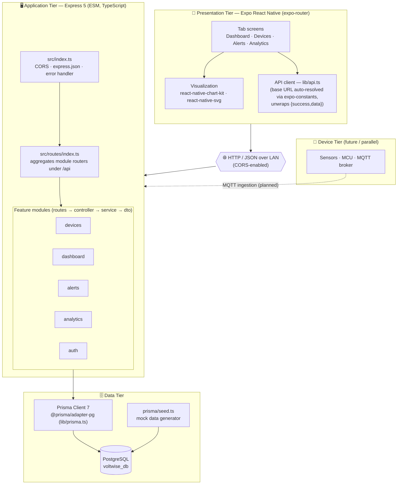
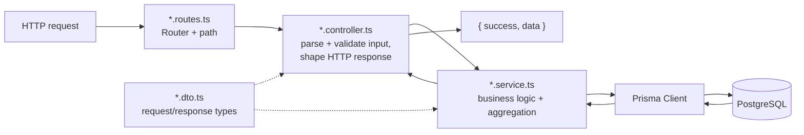

# VoltWise — System Architecture

VoltWise is a smart energy tracking & monitoring system. This document describes
the **overall architecture** of the mobile MVP as implemented in this repository:
a layered React Native (Expo) client talking over REST to a modular Express +
Prisma backend backed by PostgreSQL, with the physical IoT layer stubbed by a
mock-data seed.

## High-level architecture



## Layered request lifecycle (within the backend)



## Technology stack

| Tier | Technology | Notes |
|---|---|---|
| Mobile client | **Expo SDK 54**, React Native 0.81, React 19, **expo-router** | File-based tab navigation under `app/(tabs)` |
| Charts | react-native-chart-kit, react-native-svg | Line chart (history) + SVG donut (breakdown) |
| Client networking | `fetch` via `lib/api.ts` | Auto-derives dev host from `expo-constants`; offline-first fallbacks |
| API | **Express 5** (ESM, TypeScript) | Modular: routes/controller/service/dto per feature |
| ORM | **Prisma 7** + `@prisma/adapter-pg` | Generated client in `src/generated/prisma` |
| Database | **PostgreSQL** (`voltwise_db`) | 7 tables + 2 enums |
| Data seed | `prisma/seed.ts` | Stands in for the IoT data stream in the MVP |
| Device tier | Sensors / MCU / MQTT | **Planned** — ingestion bridge writes `EnergyReading` |

## Module → feature → data mapping

| Backend module | Endpoints | App screen | Core MVP feature |
|---|---|---|---|
| `dashboard` | `GET /api/dashboard` | Dashboard | Real-time energy dashboard, live metrics, history |
| `devices` | `GET/POST/PATCH/DELETE /api/devices` | Devices | Virtual device registry + software toggles |
| `alerts` | `GET /api/alerts`, `PATCH /:id/read`, `POST /read-all` | Alerts | Instant alerts & anomaly log |
| `analytics` | `GET /api/analytics` | Analytics | Bill predictor + high-consumption ranking |
| `auth` | `POST /api/auth/register|login` | (profile) | Account scoping (minimal MVP) |

## Design principles applied

- **Separation of concerns:** thin controllers, logic in services, types in dtos.
- **User-scoped data:** every query is keyed to a `userId` (demo user for MVP),
  enforced by cascade FKs for clean multi-tenant deletion.
- **Offline-first client:** each screen ships seeded mock constants and renders
  them if the API is unreachable, then reconciles with live data on success.
- **Optimistic UI:** device add/toggle and alert reads update locally first,
  then persist — the UI never blocks on the network.
- **IoT-ready seam:** the service layer reads from `EnergyReading` regardless of
  whether rows came from the seed or a future MQTT ingestion bridge, so swapping
  the data source requires no API or app changes.

## Running the system locally

```bash
# 1) Backend — from backend/
npm install
npx prisma migrate dev --name init_voltwise   # create tables in voltwise_db
npx prisma generate
npm run seed                                   # load mock data
npm run dev                                    # API on http://localhost:3000

# 2) App — from voltwise/
npm install
npx expo start                                 # open on device/emulator/web
```

> On a physical device, `lib/api.ts` resolves the dev machine's LAN IP from
> Expo automatically. To override, set `EXPO_PUBLIC_API_URL` (e.g.
> `http://192.168.1.10:3000/api`).

## Related docs

- [ERD.md](./ERD.md) — database entities and relationships.
- [DATA_FLOW.md](./DATA_FLOW.md) — read/write data paths and sequence diagrams.
